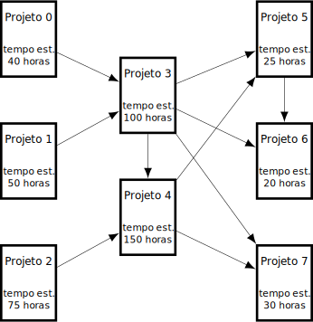

# MC558 - Tarefa 6

[Enunciado em PDF](enunc.pdf).

## Problema

### Gerente de Projetos

Um gerente de projetos acabou de receber uma excelente notícia de sua chefe: assim que entregar todos os projetos sob sua responsabilidade no momento será promovido e seu salário dobrará! Imediatamente o gerente de projetos ficou ansioso para saber quando será a promolão e pediu (para ontem) uma estimativa,
de cada equipe de cada projeto, do número de horas necessárias para concluir seu projeto. Suas equipes responderam rapidamente com suas estimativas, no entanto, lembraram que existem algumas relações de dependência entre os projetos gerenciados por ele, de forma que cada equipe só consegue começar quando
todos os projetos de que dependem estiverem concluídos. A figura abaixo mostra um exemplo de um conjunto de projetos com os respectivos tempos estimados para conclusão e os projetos dos quais dependem.

No exemplo da figura o tempo mínimo para a conclusão completa dos projetos (e para o gerente conseguir a promoção) é de 345 horas, dado pela soma dos tempos de conclusão dos projetos 1, 3, 4, 5 e 6 que dependem sequencialmente um do outro, nessa ordem. Qualquer outra sequência de dependências leva a um tempo
total de conclusão menor.



Ao perceber que determinar o tempo mínimo até a promoção é mais complicado do que imaginou inicialmente, o gerente de projetos foi lamentar com seus outros colegas gerentes sua ansiedade, e descobriu que todos eles estavam na mesma situação. Eles resolveram então se juntar e contratar você para determinar
esse tempo mpinimo para cada um deles.

## Entrada e Saída

**Entrada:** A primeira linha de cada caso de teste contém dois inteiros N e M , separados por um espaço em branco, que representam, respectivamente, quantos são os projetos (1 ≤ N ≤ 2.000) e quantas são as relações de dependência (1 ≤ M ≤ 5.000). Cada projeto é representado por um inteiro entre 0 e N−1. A segunda linha de cada caso de teste contém N inteiros ti, (1 ≤ ti ≤ 10.000) que representam os tempos estimados de conclusão de cada projeto. Cada uma das M linhas subsequentes de cada caso de teste contém dois inteiros u e v (0 ≤ u,v ≤ N−1), separados por um espaço em branco, indicando que o projeto v depende do projeto u para poder ser concluído.

**Saı́da:** Para cada caso de teste seu programa deve imprimir uma única linha contendo um único inteiro que é o tempo mínimo para o gerente concluir seus projetos atuais e obter a sua promoção (há um `\n` após o número).

### Exemplos

```bash
$ ./t6 << EOF
  5 4
  10 20 30 40 50
  0 1
  1 2
  3 1
  1 4
EOF
110
```

```bash
$ ./t6 << EOF
  8 10
  40 50 75 100 150 25 20 30
  0 3
  1 3
  2 4
  3 4
  3 5
  3 6
  3 7
  4 5
  4 7
  5 6
EOF
345
```

```bash
$ ./t6 << EOF
  6 8
  20 70 60 30 100 10
  0 1
  0 3
  1 2
  1 4
  2 5
  3 4
  4 2
  4 5
EOF
260
```

```bash
$ ./t6 << EOF
  1 0
  9384
EOF
9384
```

## Implementação e Submissão

-  A solução deverá ser implementada em C, C++, Pascal ou Python 2/Python 3. Só é permitido o uso de bibliotecas padrão.

- O programa deve ser submetido no SuSy, com o nome principal **t6** (por exemplo, `t5.c`).

- O número máximo de submissões é 20.

- A tarefa contém 10 testes abertos e 10 testes fechados. A nota será proporcional ao número de acertos nos testes fechados.

## Prazo

**A solução pode ser submetida até o dia 11/07/21.**
